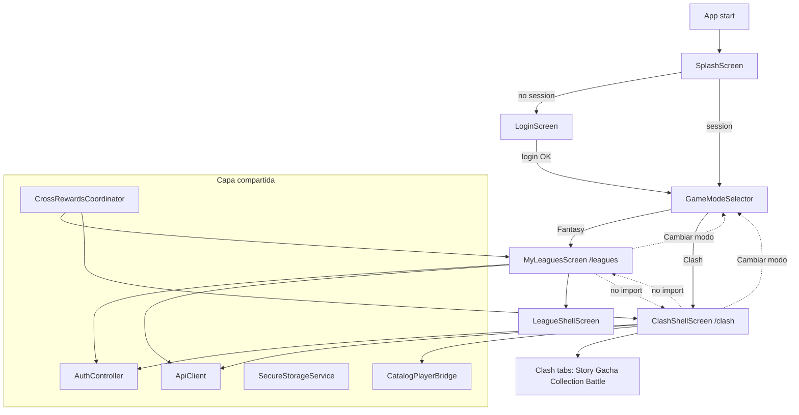

# Eternal XI — Arquitectura propuesta: integración Eternal Clash

> **Estado:** propuesta de diseño (fase 0). Sin implementación.  
> **Complementa:** `docs/CLASH_INTEGRATION_AUDIT.md`  
> **Principio rector:** Fantasy (`features/leagues/`) no se mueve, no se renombra y no se modifica salvo autorización explícita.

---

## 1. Objetivos de diseño

1. **Una sola app**, dos modos de juego claramente separados: **Fantasy** (existente) y **Clash** (nuevo).
2. **Cero imports cruzados** entre módulos de modo.
3. **Fantasy sigue funcionando igual** — mismas rutas, mismos controllers, mismas pantallas.
4. **Clash crece de forma incremental** como módulo autónomo.
5. **Recursos compartidos solo por capas explícitas** acordadas (auth, usuario, API, catálogo base, recompensas cruzadas).

---

## 2. Estructura objetivo (adaptada a la realidad)

No se reorganiza Fantasy a `features/fantasy/` en la fase inicial. El mapeo conceptual es:

```
lib/
├── app/                          # Shell global (sin lógica de modo)
│   ├── app.dart
│   ├── router.dart               # Rutas raíz + redirect auth (futuro)
│   ├── routes.dart               # Paths Fantasy + Clash + mode
│   ├── game_mode.dart            # [NUEVO] enum GameMode { fantasy, clash }
│   └── localization/
│       ├── app_localizations.dart
│       ├── league_l10n.dart      # Fantasy — no tocar
│       ├── rewards_l10n.dart     # Fantasy — no tocar
│       └── clash_l10n.dart       # [NUEVO] solo Clash
│
├── core/                         # Infra compartida (sin semántica de modo)
│   ├── network/
│   ├── storage/
│   ├── notifications/
│   └── cross_mode/               # [NUEVO] puente explícito entre modos
│       ├── catalog_player_bridge.dart
│       └── cross_rewards_coordinator.dart
│
├── data/                         # Modelos/servicios transversales (usuario, auth)
│   ├── models/
│   │   ├── user_model.dart       # compartido
│   │   └── catalog_*.dart        # lectura compartida vía bridge
│   └── services/
│       ├── auth_api_service.dart
│       ├── user_api_service.dart
│       └── user_progress_api_service.dart
│
├── features/
│   ├── auth/                     # compartido — sin cambios de lógica en fase 1
│   ├── profile/                  # compartido
│   ├── legal/                    # compartido
│   │
│   ├── mode/                     # [NUEVO] selector y orquestación de modo
│   │   ├── screens/
│   │   │   └── game_mode_selector_screen.dart
│   │   └── controller/
│   │       └── game_mode_controller.dart
│   │
│   ├── leagues/                  # = Fantasy (ACTUAL, congelado)
│   │   └── …                     # 85 archivos sin mover
│   │
│   ├── rewards/                  # = Recompensas Fantasy (ACTUAL, congelado)
│   │   └── …
│   │
│   └── clash/                    # [NUEVO] módulo Eternal Clash
│       ├── data/
│       │   ├── models/           # ClashCard, ClashUnit, ClashBattle, …
│       │   ├── services/
│       │   │   └── clash_api_service.dart
│       │   └── repositories/
│       │       └── clash_repository.dart
│       ├── controller/
│       │   ├── clash_profile_controller.dart
│       │   ├── clash_collection_controller.dart
│       │   └── clash_battle_controller.dart
│       ├── navigation/
│       │   ├── clash_router.dart       # sub-rutas o shell Clash
│       │   └── clash_inner_navigation.dart
│       ├── shell/
│       │   └── clash_shell_screen.dart # home Clash con bottom nav propio
│       ├── screens/
│       │   ├── clash_home_screen.dart
│       │   ├── clash_story_screen.dart
│       │   ├── clash_gacha_screen.dart
│       │   └── clash_battle_screen.dart
│       └── widgets/
│
└── shared/                       # UI genérica (sin nombres league/clash)
    └── widgets/
```

### 2.1 Por qué no renombrar `leagues` → `fantasy` ahora

- ~85 archivos + cientos de imports + rutas `/leagues` estables en producción y deep links FCM.
- El beneficio es solo cosmético; el riesgo de regresión es alto.
- Documentación y código pueden referir **Fantasy ≡ `features/leagues/`** hasta una fase de refactor opcional muy posterior.

---

## 3. Selector de modo después del login

### 3.1 Flujo propuesto

```
Splash (/)
  → restoreSession
  → si NO sesión → /login
  → si sesión     → /mode          ← [NUEVO]

Login (/login)
  → login OK
  → /mode                          ← [NUEVO] (no /leagues directo)

GameModeSelector (/mode)
  → Fantasy  → /leagues            (comportamiento actual)
  → Clash    → /clash              (nuevo shell)
  → siempre selector (sin auto-recordar último modo)

Logout (cualquier modo)
  → /login
  → limpiar preferencia de modo opcional
```

### 3.2 Implementación futura (fase 1)

| Componente | Responsabilidad |
|---|---|
| `GameMode` enum | `fantasy`, `clash` en `app/game_mode.dart` |
| `GameModeController` | Expone modo activo en sesión; **no** persiste último modo automáticamente |
| `GameModeSelectorScreen` | UI de elección; **no** contiene lógica Fantasy ni Clash |
| Cambios mínimos | `splash_screen.dart` y `login_screen.dart` redirigen a `/mode` en lugar de `/leagues` |

### 3.3 Selector siempre visible (decisión de producto)

- Tras login o restaurar sesión, **siempre** se muestra `/mode` (Fantasy | Clash).
- **No** recordar automáticamente el último modo (sin `lastGameMode` en storage por defecto).
- El usuario puede volver al selector manualmente con «Cambiar modo» desde perfil o shell activo.
- Ver `CLASH_PRODUCT_DESIGN.md` §2.1.

---

## 4. Navegación independiente por modo

### 4.1 GoRouter — árbol propuesto

Mantener rutas Fantasy **idénticas**. Añadir rama Clash paralela:

```dart
// Pseudocódigo — NO implementar aún
GoRoute(path: '/mode', builder: GameModeSelectorScreen),

// Fantasy — SIN CAMBIOS de paths
GoRoute(path: '/leagues', ...),
GoRoute(path: '/profile', ...),

// Clash — NUEVO prefijo aislado
GoRoute(
  path: '/clash',
  builder: ClashShellScreen,
  routes: [
    GoRoute(path: 'story', ...),
    GoRoute(path: 'gacha', ...),
    GoRoute(path: 'battle/:id', ...),
    GoRoute(path: 'collection', ...),
  ],
),
```

Constantes en `app/routes.dart`:

```dart
static const modeSelector = '/mode';
static const clash = '/clash';
static const clashStory = '/clash/story';
// ...
```

### 4.2 Shell Clash

`ClashShellScreen` análogo a `LeagueShellScreen` pero:
- Bottom nav propio (Historia, Gacha, Colección, Batalla, Ajustes Clash).
- **No** importa tabs ni widgets de `features/leagues/`.
- Navegación interna profunda vía `ClashInnerNavigation` (mismo patrón que `LeagueInnerNavigation`, archivo separado).

### 4.3 Cambio de modo en runtime

- Acción global «Cambiar modo» → `context.go(AppRoutes.modeSelector)` o toggle directo.
- Al salir de Fantasy: no requiere limpiar `LeaguesController` (puede quedar en memoria) pero **no** debe haber listeners Clash escuchando estado liga.
- Al salir de Clash: invalidar controllers Clash scoped (dispose al desmontar shell).

### 4.4 Push notifications (fase posterior)

Extender `PushNotificationHandler`:

```dart
// Payload futuro
{ "type": "league", "idLiga": 42 }
{ "type": "clash", "screen": "battle", "battleId": "abc" }
```

Routing por `type`; **no** mezclar en handler de liga existente sin bifurcar.

---

## 5. Estado independiente

### 5.1 Reglas

| Estado | Ubicación | Scope |
|---|---|---|
| Sesión, usuario | `AuthController` (raíz) | Global |
| Preferencias UI | `UserPreferencesController` (raíz) | Global |
| Modo activo (sesión) | `GameModeController` (raíz) | Global |
| Ligas, mercado, alineación | Controllers en `features/leagues/` | Solo Fantasy |
| Fichas, sobres liga | `RewardsController` (local + API liga) | Solo Fantasy |
| Colección Clash, stamina, gacha | Controllers en `features/clash/controller/` | Solo Clash |
| Batalla en curso | `ClashBattleController` | Solo Clash, dispose al salir |

### 5.2 Registro Provider

**Fase 1:** añadir solo `GameModeController` en `main.dart`.

**Fase 2+:** controllers Clash registrados con `ChangeNotifierProvider` **dentro** de `ClashShellScreen`, no en raíz:

```dart
// Pseudocódigo
MultiProvider(
  providers: [
    ChangeNotifierProvider(create: (_) => ClashProfileController(...)),
    ChangeNotifierProvider(create: (_) => ClashCollectionController(...)),
  ],
  child: ClashShellScreen(...),
)
```

**Evitar:** añadir `ClashCollectionController` junto a `LeaguesController` en `main.dart` (anti-patrón observado con carga innecesaria).

---

## 6. Modelos Clash vinculados por `playerId`

### 6.1 Identidad del jugador real

El backend Eternal XI ya expone jugadores reales con **`idJugador`** (entero) en catálogo y ligas.

Clash debe modelar:

```dart
// Pseudocódigo — features/clash/data/models/clash_card.dart
class ClashCard {
  final String id;              // ID carta Clash (instancia)
  final int playerId;           // = idJugador catálogo Eternal XI
  final ClashRarity rarity;
  final int level;
  final int power;
  // NUNCA: idLigaJugador, valorMercado, cansancio, …
}
```

### 6.2 Puente de catálogo (capa compartida explícita)

`core/cross_mode/catalog_player_bridge.dart`:

```dart
// Pseudocódigo
class CatalogPlayerSnapshot {
  final int playerId;
  final String displayName;
  final String? photoUrl;
  final String position;
}

abstract class CatalogPlayerBridge {
  Future<CatalogPlayerSnapshot?> resolve(int playerId);
}
```

Implementación inicial: llama endpoint catálogo existente vía servicio dedicado en `core/` o `data/`, **sin** importar `features/leagues/screens/`.

Fantasy sigue usando `CatalogTeamPlayer` / `LeagueSquadPlayer`. Clash consume solo `CatalogPlayerSnapshot`.

### 6.3 Prohibiciones de modelo

- No añadir campos Clash a `UserModel`, `LeagueSquadPlayer`, `CatalogTeamPlayer`.
- No crear «super-modelo» jugador en `data/models/`.
- Duplicar DTOs Clash en `features/clash/data/models/` aunque parezcan redundantes.

---

## 7. Servicios y repositorios Clash independientes

### 7.1 Capa de datos Clash

```
features/clash/data/
├── services/clash_api_service.dart    → /clash/* (endpoints nuevos backend)
├── repositories/clash_repository.dart → orquesta cache + API
└── models/                            → DTOs exclusivos Clash
```

`ClashApiService` recibe `ApiClient` (mismo Dio, mismo JWT) pero:
- Paths bajo prefijo acordado: `/clash/profile`, `/clash/gacha/pull`, `/clash/battle/start`, etc.
- **No** extiende `LeaguesApiService`.
- **No** importa modelos `league_*`.

### 7.2 Catálogo compartido (solo lectura)

Opciones (decidir con backend en fase 1):

| Opción | Descripción |
|---|---|
| A | Reutilizar endpoints `/catalog/*` desde `CatalogPlayerBridge` en `core/` |
| B | Nuevo `/clash/catalog/players/{id}` que devuelva subset mínimo |
| C | Duplicar fetch en `ClashApiService.getPlayerSnapshot(playerId)` |

Recomendación: **A + DTO mínimo en bridge** para no acoplar Clash al contexto liga.

---

## 8. Recompensas cruzadas — capa explícita

Fantasy rewards (`features/rewards/`) están acoplados a `idLiga` + `RewardsApiService`. Clash tendrá su propia economía (gemas, tickets gacha, etc.).

### 8.1 Problema

Recompensas cruzadas («completar misión Clash → fichas Fantasy») no deben importar controllers de either mode directamente.

### 8.2 Solución: `CrossRewardsCoordinator`

Ubicación: `core/cross_mode/cross_rewards_coordinator.dart`

Responsabilidades:
- Escuchar eventos de recompensa (`CrossRewardEvent`) desde API o push.
- Exponer callbacks/stream **neutros** (`onFantasyTokensGranted`, `onClashCurrencyGranted`).
- Cada modo se suscribe solo a lo suyo:

```dart
// Fantasy (futuro, opt-in)
crossRewards.onFantasyTokensGranted.listen((e) {
  // refrescar UserResources / RewardsHub si visible
});

// Clash
crossRewards.onClashCurrencyGranted.listen((e) {
  clashProfileController.applyGrant(e);
});
```

### 8.3 API backend sugerida

```
POST /cross-rewards/grant   (servidor autoriza)
GET  /cross-rewards/pending (inbox unificada opcional)
```

El frontend **no** calcula recompensas cruzadas localmente.

### 8.4 Qué no hacer

- Importar `RewardsController` desde Clash.
- Importar `ClashGachaController` desde `features/rewards/`.
- Añadir campos Clash a `UserResourcesResponse` sin versionado API.

---

## 9. Prohibición de dependencias directas entre modos

### 9.1 Regla de imports (lint futuro recomendado)

```
features/clash/**     → NO importar features/leagues/**, features/rewards/**
features/leagues/**   → NO importar features/clash/**
features/rewards/**   → NO importar features/clash/**
```

### 9.2 Dependencias permitidas (whitelist)

Desde **cualquier feature** hacia:
- `app/` (routes, theme, game_mode)
- `core/` (network, storage, cross_mode)
- `data/models/user_model.dart`, servicios auth/user
- `shared/widgets/` (componentes genéricos)
- `features/auth/`, `features/profile/`, `features/legal/`
- `features/mode/` (selector)

Desde **Clash** hacia catálogo:
- Solo `core/cross_mode/catalog_player_bridge.dart` (no `catalog_team_players_screen.dart`).

### 9.3 Comunicación entre modos

| Mecanismo | Permitido |
|---|---|
| Import directo | ❌ |
| `GameModeController` + GoRouter | ✅ cambio de modo |
| `CrossRewardsCoordinator` | ✅ recompensas |
| `CatalogPlayerBridge` | ✅ datos jugador base |
| `AuthController.currentUser` | ✅ identidad |
| Event bus global ad-hoc | ⚠️ solo si queda documentado en `core/` |

---

## 10. Estrategia gradual de implementación

### Fase 0 — Diseño (actual)
- [x] Auditoría frontend (`CLASH_INTEGRATION_AUDIT.md`)
- [x] Arquitectura (`CLASH_INTEGRATION_ARCHITECTURE.md`)
- [ ] Validación producto / backend API Clash
- [ ] Inventario documentación prototipo Eternal Clash (repo externo)

### Fase 1 — Shell sin gameplay
- Rutas `/mode`, `/clash` (placeholder)
- `GameModeSelectorScreen` + `GameModeController`
- Redirigir splash/login a `/mode`
- `ClashShellScreen` vacío con bottom nav stub
- **Fantasy intacto:** `/leagues` funciona igual desde selector

### Fase 2 — Capa datos Clash
- `ClashApiService`, modelos base, `ClashRepository`
- `CatalogPlayerBridge` + prueba con 1 jugador
- Pantalla colección vacía conectada a API

### Fase 3 — Gameplay vertical slice
- Gacha mínima (1 banner)
- Batalla PvE simple (1 stage)
- Historia stub (1 capítulo)

### Fase 4 — Recompensas cruzadas
- Backend + `CrossRewardsCoordinator`
- UI inbox opcional en perfil global

### Fase 5 — Pulido y notificaciones Clash
- FCM `type: clash`
- Animaciones, assets, balance

### Fase 6 (opcional, muy posterior)
- Renombrar `features/leagues` → `features/fantasy` con alias de rutas
- Unificar temas visuales bajo design system

---

## 11. Reutilizar ideas del prototipo Eternal Clash sin copiar código a ciegas

El repositorio/prototipo Eternal Clash **no está** en este monorepo (búsqueda sin referencias `clash` en código actual).

### 11.1 Proceso recomendado por feature

1. **Extraer spec**, no código: GDD, flujos UX, economía, tablas de rareza.
2. **Mapear entidades** prototipo → modelos Clash nuevos (`ClashCard`, no `LeagueSquadPlayer`).
3. **Comparar API** prototipo vs API Eternal XI planificada; anotar gaps.
4. **Reescribir** pantallas en estilo Eternal XI (`Lumiare`, `XiColors`, `XiBottomNav` pattern).
5. **Portar solo** utilidades puras (p. ej. fórmulas de daño) tras revisión, a `features/clash/utils/`.
6. **No portar** routers, providers globales, ni modelos acoplados del prototipo Flutter standalone.

### 11.2 Checklist antes de copiar un archivo del prototipo

- [ ] ¿Importa algo Fantasy o liga? → rechazar
- [ ] ¿Tiene su propio `main.dart` / `MaterialApp`? → descomponer, no copiar entero
- [ ] ¿Modelo mezcla `playerId` con estado de batalla? → separar DTOs
- [ ] ¿Usa paquetes no presentes en `pubspec.yaml`? → PR de dependencias aparte
- [ ] ¿Pantalla equivalente ya existe en Eternal XI? → reutilizar patrón, no archivo

### 11.3 Documentación a traer del prototipo

- Árbol de módos / capítulos historia
- Tablas gacha (rates, pity)
- Formación batalla y tipos elemento
- Wireframes gacha y resultado multi-pull
- **No traer:** estructura de carpetas del app standalone tal cual

---

## 12. Archivos probables a tocar — primera fase de implementación

### 12.1 Crear (nuevos)

| Archivo | Propósito |
|---|---|
| `lib/app/game_mode.dart` | Enum + helpers |
| `lib/features/mode/screens/game_mode_selector_screen.dart` | UI selector |
| `lib/features/mode/controller/game_mode_controller.dart` | Estado modo |
| `lib/features/clash/shell/clash_shell_screen.dart` | Shell placeholder |
| `lib/app/localization/clash_l10n.dart` | Strings Clash |
| `docs/CLASH_API.md` | Contrato backend (futuro) |

### 12.2 Modificar (mínimo indispensable)

| Archivo | Cambio |
|---|---|
| `lib/app/routes.dart` | Añadir `modeSelector`, `clash` |
| `lib/app/router.dart` | Registrar rutas nuevas |
| `lib/features/auth/screens/splash_screen.dart` | `go(/mode)` si sesión |
| `lib/features/auth/screens/login_screen.dart` | `go(/mode)` tras login |
| `lib/core/storage/secure_storage_service.dart` | Sin cambios en fase 1 (no `lastGameMode`) |
| `lib/main.dart` | Provider `GameModeController` |
| `lib/app/localization/app_localizations.dart` | Strings selector modo (si van en app) |

### 12.3 Modificar (fase 1 opcional / UX)

| Archivo | Cambio |
|---|---|
| `lib/features/profile/screens/edit_profile_screen.dart` | Enlace «Cambiar modo» |
| `lib/features/leagues/screens/my_leagues_screen.dart` | Botón volver a selector (solo navegación, sin lógica Clash) |

---

## 13. Archivos que NO deben tocarse (fase 1)

### 13.1 Fantasy core — congelado

```
features/leagues/**                    (todos los 85 archivos)
features/leagues/squad/**
features/leagues/tabs/**
features/leagues/shell/league_shell_screen.dart
features/leagues/navigation/league_inner_navigation.dart
features/leagues/controller/**
data/services/leagues_api_service.dart
data/models/league_*.dart
```

### 13.2 Recompensas Fantasy — congelado

```
features/rewards/**
```

### 13.3 Modelos — no extender

```
data/models/league_squad_player.dart
data/models/league_player_detail.dart
data/models/user_model.dart          (sin campos Clash)
data/models/catalog_team_player.dart (sin campos Clash)
```

### 13.4 Rutas Fantasy — paths inmutables

```
/leagues
/leagues/create
/leagues/join
/leagues/:leagueId
/profile/tokens-shop
```

### 13.5 Otros

```
features/home/screens/home_screen.dart   (ignorar hasta decidir eliminar o reutilizar)
core/network/auth_interceptor.dart       (salvo nuevos public paths /clash/auth si aplica)
pubspec.yaml                             (fase 0-1: sin dependencias nuevas)
```

---

## 14. Diagrama de flujo objetivo



---

## 15. Criterios de aceptación fase 1

1. Usuario existente inicia sesión y **elige** Fantasy o Clash.
2. Elegir Fantasy lleva a **exactamente** el mismo `MyLeaguesScreen` de hoy.
3. Elegir Clash abre shell placeholder sin errores ni imports Fantasy.
4. Ningún test/regresión en flujos liga, mercado, alineación, rewards.
5. `flutter analyze` sin imports prohibidos Clash ↔ leagues.
6. Documentación backend Clash API acordada antes de fase 2.

---

## 16. Decisiones pendientes de producto/backend

| Tema | Pregunta |
|---|---|
| Cuenta Clash | ¿Progreso Clash por `userId` o entidad separada? |
| API namespace | ¿`/api/v1/clash/*` o servicio separado? |
| Economía cruzada | ¿Qué recompensas cruzan y en qué dirección? |
| Selector | **Decidido:** siempre visible; no auto-recordar último modo |
| Perfil | ¿Nivel cuenta (`UserModel.nivel`) es global o por modo? |
| Offline | ¿Clash requiere cache local (SQLite) o solo online? |

Estas decisiones no bloquean la fase 1 (shell + selector) pero sí la fase 2+.

---

*Documento listo para revisión. No implementar código hasta confirmación explícita del equipo.*
