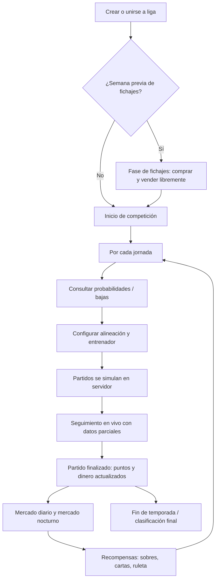
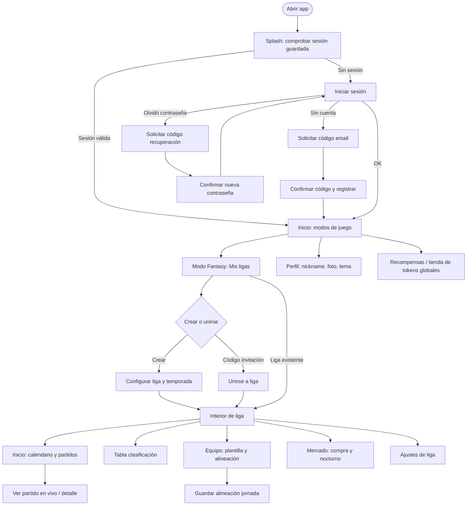
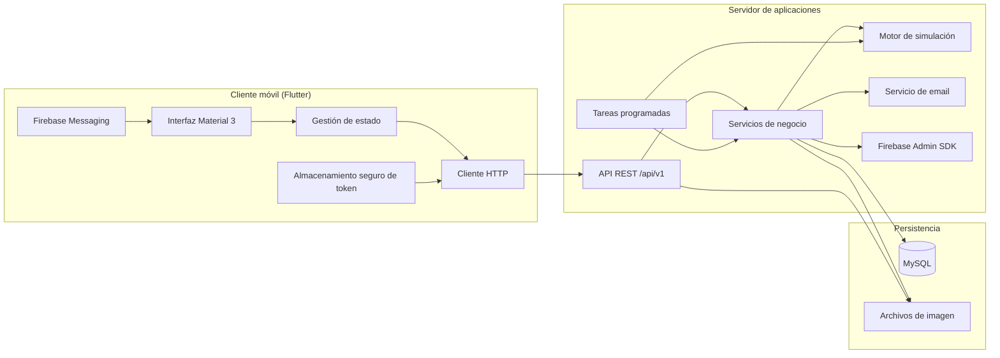
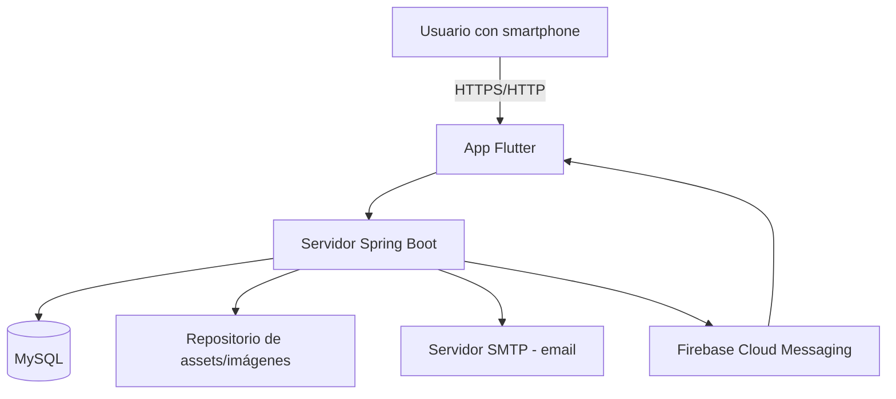
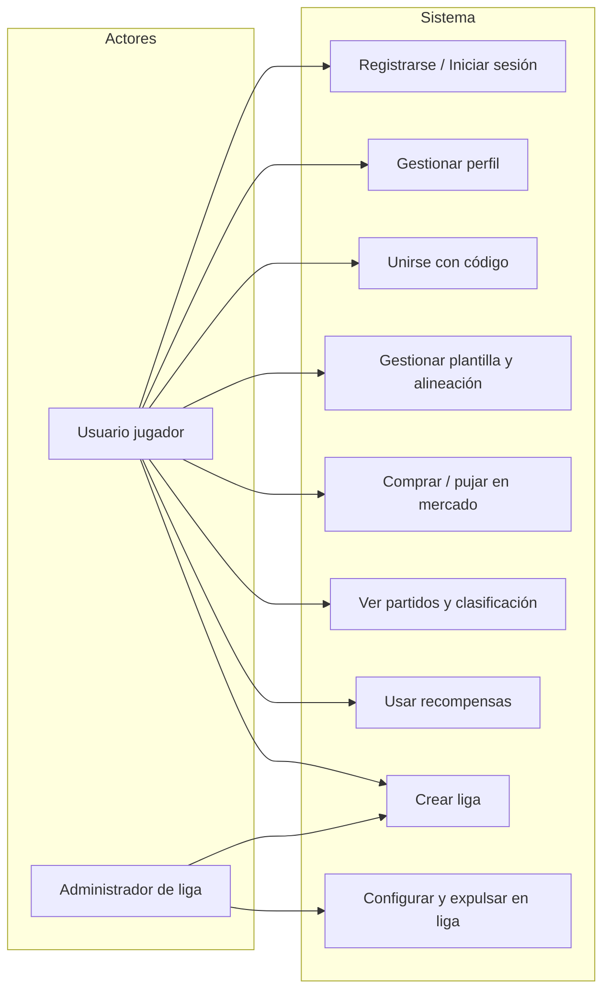

# Eternal XI — Documentación de proyecto final

**Titulación:** Ciclo Formativo de Grado Superior (Desarrollo de Aplicaciones Multiplataforma / Web, según corresponda)  
**Proyecto:** Aplicación móvil de fantasy football por ligas privadas  
**Versión del producto:** 1.0.0  
**Fecha:** Mayo 2026  

---

## 1. Resumen ejecutivo

**Eternal XI** es una aplicación de fantasy football en la que grupos de usuarios compiten en **ligas privadas** basadas en temporadas reales de fútbol. Cada participante gestiona un equipo con presupuesto virtual: ficha jugadores, configura alineaciones por jornada, sigue partidos simulados en tiempo casi real y acumula puntos fantasy según el rendimiento de sus jugadores.

El sistema se compone de:

- **Cliente móvil** multiplataforma (Flutter), orientado principalmente a Android.
- **API REST** en Java con Spring Boot, que centraliza reglas de negocio, simulación de partidos y persistencia.
- **Base de datos relacional** MySQL con migraciones versionadas.
- **Servicios auxiliares:** correo electrónico para verificación de cuenta y recuperación de contraseña; Firebase Cloud Messaging para notificaciones push.

El modo de juego principal (**Modo Fantasy**) está operativo. El **Modo Carrera** aparece en la interfaz como funcionalidad futura (actualmente bloqueada).

---

## 2. Objetivos del proyecto


| Objetivo                     | Descripción                                                                                                                                          |
| ---------------------------- | ---------------------------------------------------------------------------------------------------------------------------------------------------- |
| **Entretenimiento social**   | Permitir que amigos, compañeros o comunidades jueguen una liga fantasy sin depender de plataformas comerciales cerradas.                             |
| **Gestión completa de liga** | Creación, invitación por código, calendario, clasificación, mercado y recompensas en un solo producto.                                               |
| **Experiencia “directo”**    | Partidos simulados con eventos progresivos y anti-spoiler: los puntos y estadísticas sensibles no se revelan antes de tiempo en la app.              |
| **Aprendizaje técnico**      | Integrar cliente móvil, API REST, base de datos, tareas programadas, almacenamiento seguro de sesión y notificaciones push en un entorno desplegado. |


---

## 3. Público objetivo


| Segmento                          | Motivación                                                                                                         |
| --------------------------------- | ------------------------------------------------------------------------------------------------------------------ |
| **Aficionados al fútbol (18+)**   | Conocen ligas, jornadas, mercado de fichajes y puntuaciones fantasy.                                               |
| **Grupos de amigos o compañeros** | Buscan una liga privada configurable (número de participantes, calendario, recompensas).                           |
| **Usuarios de apps fantasy**      | Acostumbrados a alinear once titulares, consultar probabilidades de titularidad y seguir el mercado.               |
| **Administradores de liga**       | Usuarios que crean la liga, definen reglas económicas y pueden gestionar participantes (expulsión, configuración). |


**Perfil técnico del usuario:** no se exige; la app está pensada para uso cotidiano en smartphone. Se asume conexión a Internet estable.

**Idioma:** interfaz preparada para localización (español como idioma principal del producto).

---

## 4. Descripción del producto

Eternal XI no replica un videojuego de acción: es un **manager fantasy** donde el valor está en:

1. **Construir plantilla** dentro de un presupuesto.
2. **Competir por jornadas** con alineaciones y entrenador opcional.
3. **Reaccionar al mercado** (compras entre usuarios y subastas nocturnas).
4. **Progresar** mediante puntos de recompensa, sobres/cartas y ruleta de entrenador.

Los datos de jugadores, equipos y temporadas provienen de un **catálogo** gestionado en servidor (no introducido manualmente por el usuario final). Las imágenes (escudos, fotos, entrenadores) se sirven desde la API como recursos HTTP, sin exponer rutas internas del servidor.

---

## 5. Cómo se juega

### 5.1. Conceptos básicos


| Concepto             | Significado en Eternal XI                                                                                      |
| -------------------- | -------------------------------------------------------------------------------------------------------------- |
| **Liga**             | Competición privada entre varios participantes (10–20, según configuración).                                   |
| **Temporada**        | Plantilla de calendario real (equipos y jugadores del catálogo asociados a esa temporada).                     |
| **Participante**     | Usuario inscrito en una liga con su propio equipo, dinero virtual y plantilla.                                 |
| **Jornada**          | Ronda de partidos; en cada una el usuario debe tener alineación válida para sumar puntos.                      |
| **Puntos fantasy**   | Se calculan por jugador según estadísticas del partido simulado (goles, asistencias, minutos, tarjetas, etc.). |
| **Dinero virtual**   | Presupuesto para fichajes; se gana también según puntos fantasy configurados por la liga.                      |
| **Valor de mercado** | Precio dinámico de cada jugador en la liga; evoluciona con el rendimiento reciente.                            |


### 5.2. Ciclo de una liga (fases)




**Fase de fichajes (opcional):** si el creador activa “semana previa de fichajes”, los participantes disponen de un periodo antes del primer partido para armar plantilla sin presión de jornada en curso.

**Durante la temporada:** en cada jornada el jugador humano debe **guardar la alineación** (formación, titulares y suplentes según reglas del sistema). El servidor prepara y simula los partidos de los equipos “reales” del catálogo; los fantasy points de cada jugador de la liga dependen de esas actuaciones.

### 5.3. Puntuación fantasy (resumen)

Los puntos se desglosan en categorías visibles en la app (minutos, goles, asistencias, regates, recuperaciones, paradas, portería a cero, goles encajados, nota de prensa, tarjetas, lesión en partido). La ponderación **depende de la posición** (portero, defensa, mediocentro, delantero). Ejemplos de reglas:

- Minutos jugados: bonificación por jugar y por completar 60 minutos o más.
- Goles: valen más para porteros/defensas que para delanteros.
- Portero: paradas y goles encajados afectan la puntuación de forma específica.
- Tarjetas y lesión en partido: penalizan.

El total del desglose coincide con los puntos registrados en la jornada. En partidos **en curso**, la API solo devuelve estadísticas hasta el minuto “visible” (anti-spoiler).

### 5.4. Economía y mercado


| Mecánica                     | Funcionamiento                                                                                                                                            |
| ---------------------------- | --------------------------------------------------------------------------------------------------------------------------------------------------------- |
| **Presupuesto inicial**      | Al unirse, el participante recibe plantilla y dinero según reglas del servidor.                                                                           |
| **Compra directa**           | En la pestaña Mercado se listan jugadores de otros equipos (o del pool) con precio; compra instantánea si hay saldo.                                      |
| **Ofertas**                  | Negociación entre participantes (según endpoints de mercado).                                                                                             |
| **Mercado nocturno**         | Subastas programadas; las pujas bloquean saldo hasta resolución o cancelación.                                                                            |
| **Dinero por punto fantasy** | Configurable al crear la liga (ej. 100 000 € – 300 000 € por punto).                                                                                      |
| **Valor dinámico**           | Tras partidos finalizados, el valor de mercado de los jugadores puede subir o bajar según rendimiento reciente (proceso automático nocturno en servidor). |


### 5.5. Clasificación y recompensas

- **Tabla:** ranking de participantes por puntos acumulados en la liga.
- **Puntos de recompensa:** moneda meta por liga para abrir sobres, usar cartas (efectos sobre jugadores/equipo) y ruleta de entrenador.
- **Entrenador fantasy:** asignación opcional que modifica la experiencia de alineación (inventario y activación por jornada).

### 5.6. Modos de juego en la app


| Modo             | Estado                                                               |
| ---------------- | -------------------------------------------------------------------- |
| **Modo Fantasy** | Activo: ligas, mercado, alineaciones, partidos, recompensas.         |
| **Modo Carrera** | Bloqueado en interfaz; reservado para evolución futura del producto. |


---

## 6. Flujo de usuario en la aplicación

Diagrama del recorrido típico desde la instalación hasta jugar una jornada:




### 6.1. Pantallas principales (mapa funcional)


| Área               | Pantallas / acciones                                                                                                                                    |
| ------------------ | ------------------------------------------------------------------------------------------------------------------------------------------------------- |
| **Autenticación**  | Splash, login, registro con verificación por email, recuperación de contraseña.                                                                         |
| **Inicio**         | Selector de modo; acceso a perfil y monedas/tokens de usuario.                                                                                          |
| **Ligas**          | Listado propio, crear liga, unirse por código.                                                                                                          |
| **Dentro de liga** | 5 pestañas: Inicio, Tabla, Equipo, Mercado, Ajustes.                                                                                                    |
| **Detalle**        | Ficha de jugador, historial por jornadas, partidos en vivo, historial de mercado, alineaciones de otros participantes (con restricciones anti-spoiler). |
| **Recompensas**    | Hub global o por liga: sobres, cartas, ruleta de entrenador.                                                                                            |


### 6.2. Configuración al crear una liga

El administrador puede definir:

- Nombre de la liga y **temporada** del catálogo.
- **Máximo de participantes** (10–20).
- **Calendario:** solo fines de semana o también martes/miércoles.
- **Formato:** solo ida o ida y vuelta.
- **Semana previa de fichajes:** sí/no.
- **Recompensa base por jornada** (puntos de recompensa).
- **Dinero otorgado por punto fantasy** en la liga.

Tras crear la liga, se genera un **código de invitación** para el resto de participantes.

---

## 7. Arquitectura y estructura de funcionamiento

La documentación describe **comportamiento y capas**, no implementación línea a línea.

### 7.1. Vista general




### 7.2. Responsabilidades por capa


| Capa                                  | Responsabilidad                                                                                                                                              |
| ------------------------------------- | ------------------------------------------------------------------------------------------------------------------------------------------------------------ |
| **Presentación (Flutter)**            | Navegación, formularios, listas, visualización de partidos en vivo, mercado y alineaciones. No decide reglas críticas (puntos, precios finales, simulación). |
| **Controladores / estado en cliente** | Caché de pantalla, refrescos, validación de formularios básicos, reintentos de red.                                                                          |
| **API REST**                          | Punto único de acceso: autenticación, ligas, plantillas, partidos, mercado, recompensas, assets.                                                             |
| **Servicios de dominio**              | Lógica de ligas, mercado nocturno, puntos fantasy, valor dinámico, recompensas, expulsión de usuarios, etc.                                                  |
| **Simulación**                        | Preparación de alineaciones “reales”, generación de eventos de partido, persistencia de resultados y efectos (lesiones, sanciones).                          |
| **Planificadores (schedulers)**       | Automatización: simulación periódica, mercado nocturno, valor de jugadores, probabilidades de titularidad, mantenimiento nocturno.                           |
| **Base de datos**                     | Fuente de verdad: usuarios, ligas, jornadas, partidos, puntuaciones, transacciones de mercado, cartas.                                                       |


### 7.3. Comunicación cliente–servidor

1. El usuario se autentica; el servidor devuelve un **token de sesión**.
2. El cliente guarda el token en **almacenamiento seguro** del dispositivo.
3. Las peticiones posteriores incluyen el token; si expira o es inválido, la app redirige a login.
4. Las respuestas son **JSON** mediante HTTP(S); las imágenes se piden por URLs bajo `/api/v1/assets/...`.

### 7.4. Procesos automáticos en servidor (sin intervención del usuario)


| Proceso                           | Propósito                                                                                                             |
| --------------------------------- | --------------------------------------------------------------------------------------------------------------------- |
| **Automatización de liga**        | Preparar partidos pendientes y avanzar simulaciones según calendario (cron configurable, zona horaria Europa/Madrid). |
| **Mercado nocturno**              | Abrir/cerrar subastas y adjudicar jugadores.                                                                          |
| **Valor dinámico**                | Actualizar precios de jugadores según rendimiento.                                                                    |
| **Probabilidades de titularidad** | Recalcular chances de ser titular para ayudar al usuario a alinear.                                                   |
| **Mantenimiento nocturno**        | Tareas de consolidación (valor, titularidades, sincronización de valoraciones).                                       |


Estos procesos permiten que la liga avance aunque ningún usuario tenga la app abierta.

### 7.5. Anti-spoiler y partidos en vivo

Mientras un partido está **en juego**, el servidor filtra:

- Marcador y eventos visibles solo hasta el minuto permitido.
- Puntos fantasy y desglose de jugadores afectados.
- Ciertas bajas (lesión/sanción) hasta que el evento sea visible en la cronología.

Cuando el partido pasa a **finalizado**, se persisten estadísticas completas y la app muestra el detalle íntegro.

---

## 8. Tecnologías utilizadas

### 8.1. Cliente móvil (`eternalxi_front`)


| Tecnología                             | Uso                                                                                   |
| -------------------------------------- | ------------------------------------------------------------------------------------- |
| **Dart**                               | Lenguaje principal del cliente.                                                       |
| **Flutter**                            | Framework UI multiplataforma (Android, iOS, Windows, Linux, macOS y web en proyecto). |
| **Material Design 3**                  | Componentes visuales y temas claro/oscuro.                                            |
| **Provider**                           | Gestión de estado (auth, ligas, perfil, preferencias).                                |
| **go_router**                          | Navegación declarativa entre pantallas.                                               |
| **Dio**                                | Cliente HTTP para la API.                                                             |
| **flutter_secure_storage**             | Token y preferencias sensibles en el dispositivo.                                     |
| **firebase_core / firebase_messaging** | Notificaciones push.                                                                  |
| **timezone**                           | Fechas de mercado y calendario en hora local.                                         |
| **image_picker / image_cropper**       | Foto de perfil.                                                                       |


### 8.2. Backend (`eternalxi_api_back`)


| Tecnología             | Uso                                                                          |
| ---------------------- | ---------------------------------------------------------------------------- |
| **Java 17**            | Lenguaje del servidor.                                                       |
| **Spring Boot 3.5**    | Framework web, inyección de dependencias, validación.                        |
| **Spring Web**         | Exposición REST.                                                             |
| **Spring Mail**        | Envío de códigos de verificación y recuperación.                             |
| **MySQL**              | Base de datos relacional.                                                    |
| **JDBC / SQL**         | Acceso a datos (repositorios y servicios).                                   |
| **Migraciones SQL**    | Evolución del esquema (`db/migration`).                                      |
| **Firebase Admin SDK** | Envío de notificaciones push desde servidor.                                 |
| **Maven**              | Construcción y empaquetado del JAR ejecutable.                               |
| **JUnit**              | Pruebas unitarias de componentes críticos (calendario, formaciones, puntos). |


### 8.3. Herramientas y metodología


| Área                          | Herramienta                                                                      |
| ----------------------------- | -------------------------------------------------------------------------------- |
| Control de versiones          | Git                                                                              |
| IDE                           | Android Studio / VS Code / IntelliJ (según capa)                                 |
| Análisis estático cliente     | `flutter analyze`                                                                |
| Documentación técnica interna | Markdown en `eternalxi_api_back/docs/` (auditorías fantasy, mercado, simulación) |


---

## 9. Infraestructura y despliegue

> **Nota de seguridad:** esta documentación **no incluye** contraseñas, claves API, tokens JWT, credenciales de base de datos ni rutas privadas del servidor. Esas configuraciones residen en variables de entorno o ficheros locales excluidos del repositorio.

### 9.1. Topología




### 9.2. Entornos


| Entorno                       | Descripción                                                                                                                                                                         |
| ----------------------------- | ----------------------------------------------------------------------------------------------------------------------------------------------------------------------------------- |
| **Desarrollo local**          | API en máquina del desarrollador; cliente apunta a URL local o de pruebas configurada en constantes de la app (sin publicar secretos).                                              |
| **Producción / demostración** | API desplegada en un **VPS** (servidor virtual Linux). Cliente compilado en release apunta a la URL pública del API. Base de datos MySQL en el mismo entorno o servicio gestionado. |


### 9.3. Despliegue del backend (resumen operativo)

1. Compilar el proyecto Maven → artefacto JAR ejecutable.
2. Copiar el JAR al servidor y ejecutarlo como servicio (systemd o equivalente).
3. Configurar propiedades de aplicación: puerto, datasource MySQL, correo, rutas de assets, Firebase (ruta al JSON de cuenta de servicio en servidor, **no** en el repositorio).
4. Aplicar migraciones SQL en la base de datos.
5. Opcional: proxy inverso (nginx) con TLS para HTTPS.

### 9.4. Despliegue del cliente

1. `flutter pub get` y `flutter build apk` (o App Bundle para Play Store).
2. Configurar `google-services` (Firebase) por plataforma en build de release.
3. Distribución: APK interna, enlace de descarga o tienda (según requisitos del centro).

### 9.5. Datos y copias de seguridad

- La **integridad competitiva** depende de MySQL (ligas, partidos, puntuaciones).
- Se recomienda política de **copias de seguridad periódicas** de la base de datos y de la carpeta de assets en producción.
- Scripts SQL manuales en el repositorio existen para reparaciones puntuales en entornos sin migrador automático.

---

## 10. Estructura del repositorio

```
Eternal XI/
├── docs/                          # Documentación de entrega (este documento)
├── eternalxi_front/               # Aplicación Flutter
│   ├── lib/
│   │   ├── app/                   # Router, temas, rutas
│   │   ├── core/                  # Red, constantes, utilidades
│   │   ├── data/                  # Modelos y servicios API
│   │   └── features/              # Módulos: auth, home, leagues, profile, rewards
│   └── android/, ios/, ...        # Proyectos nativos por plataforma
└── eternalxi_api_back/            # API Spring Boot
    ├── src/main/java/...          # Controladores, servicios, DTOs
    ├── src/main/resources/
    │   ├── db/migration/          # Scripts de esquema
    │   └── sql/                   # Scripts manuales / auditoría
    └── docs/                      # Notas técnicas internas
```

Organización del cliente por **características** (`features`): cada módulo agrupa pantallas, widgets y controladores de un dominio (ligas, auth, recompensas).

---

## 11. Seguridad y privacidad


| Medida                            | Descripción                                                           |
| --------------------------------- | --------------------------------------------------------------------- |
| **Autenticación**                 | Login con credenciales; sesión basada en token.                       |
| **Verificación de email**         | Código de un solo uso enviado por correo antes de completar registro. |
| **Recuperación de contraseña**    | Mismo mecanismo por código temporal.                                  |
| **Almacenamiento en dispositivo** | Token en almacenamiento seguro, no en texto plano.                    |
| **Validación de entrada**         | Servidor valida peticiones (cantidades, IDs, pertenencia a liga).     |
| **Anti-spoiler**                  | Reduce trampas informáticas en partidos en directo.                   |
| **Expulsión de participante**     | Limpieza de ofertas, pujas y mercados asociados al usuario expulsado. |


**Buenas prácticas para la entrega:** entregar a el tribunal únicamente usuarios de prueba creados para la demo; no compartir accesos de administrador de producción en la memoria escrita.

---

## 12. Pruebas y calidad

- Pruebas **unitarias** en backend (calendario, formaciones, invariantes de recompensas iniciales).
- Pruebas **widget/unit** en cliente (formato de dinero, visibilidad de estadísticas, respuestas de unión a liga).
- Prueba manual recomendada para la defensa: registro → crear liga → segundo usuario se une → fichajes → alineación → visualizar partido → consultar tabla y mercado.                       

---

## 13. Limitaciones conocidas y trabajo futuro


| Elemento                | Situación                                                                                                            |
| ----------------------- | -------------------------------------------------------------------------------------------------------------------- |
| Modo Carrera            | No implementado; UI bloqueada.                                                                                       |
| Plataformas             | Desarrollo y pruebas centrados en **Android**; iOS/web requieren configuración adicional de Firebase y certificados. |
| Dependencia de servidor | Sin API no hay juego; no es offline-first.                                                                           |
| Escalabilidad           | Simulación y schedulers en un nodo; alto número de ligas simultáneas exigiría revisión de arquitectura.              |


**Líneas de mejora:** Modo Carrera, internacionalización completa, panel web de administración, HTTPS obligatorio en todos los entornos, métricas y monitorización (logs centralizados).

---

## 14. Guía rápida para la demostración oral

1. **Problema:** grupos que quieren fantasy controlado y privado.
2. **Solución:** Eternal XI — ligas con economía, simulación y recompensas.
3. **Demo en vivo (5–8 min):** login → Mis ligas → entrar en liga → mostrar alineación → Inicio con partido → Mercado → Recompensas → Perfil.
4. **Arquitectura:** Flutter + Spring + MySQL + Firebase + cron de simulación.
5. **Cierre:** aprendizajes (full stack móvil, tareas programadas, reglas de negocio complejas).

---

## 15. Referencias y anexos

- Documentación técnica interna del backend: carpeta `eternalxi_api_back/docs/`.
- README del cliente: `eternalxi_front/README.md` (instrucciones de ejecución local; **sustituir** cualquier URL o IP por la configuración de demo acordada con el centro, sin credenciales).

---

## Anexo A — Glosario


| Término                     | Definición                                                                     |
| --------------------------- | ------------------------------------------------------------------------------ |
| **Fantasy**                 | Puntuación derivada de estadísticas de jugadores reales (simulados en la app). |
| **Jornada**                 | Conjunto de partidos de una fecha/competición dentro de la liga.               |
| **OVR / valoración**        | Valor numérico de calidad del jugador en la carta/liga.                        |
| **Mercado nocturno**        | Subasta con tiempo límite y pujas.                                             |
| **Pool de mercado**         | Jugadores sin dueño humano gestionados por el sistema (equipo “liga”).         |
| **Token / puntos globales** | Moneda de usuario a nivel app (tienda de recompensas globales).                |


---

## Anexo B — Diagrama de casos de uso (UML simplificado)




---

*Documento generado para entrega académica del proyecto Eternal XI. Para exportar a PDF desde VS Code o Cursor: extensión “Markdown PDF” o impresión del vista previa Markdown.*