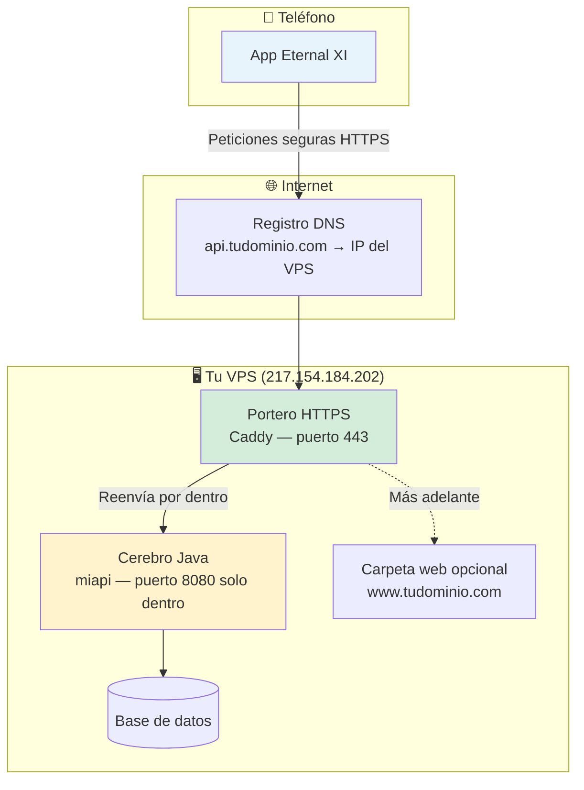
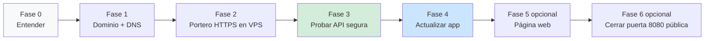

# Eternal XI — Cómo está todo y cómo poner HTTPS (guía para ti)

> **Para quién es esto:** Miguel y cualquiera que ayude (ChatGPT, familia, etc.) sin necesidad de ser informático.  
> **Objetivo:** Entender el mapa, saber qué pedir a quién, y llegar a `https://api.tudominio.com` sin romper la app que ya funciona.

---

## 1. El mapa mental (en 30 segundos)

Piensa en tu proyecto como **tres piezas** en un **mismo edificio** (el VPS):

| Pieza | Qué es en la vida real | Dónde vive hoy |
|-------|------------------------|----------------|
| **La app del móvil** | Lo que instalas en el teléfono (Flutter) | Tu PC al compilar; en el móvil del usuario |
| **La API (cerebro)** | Responde “fichar jugador”, “mi liga”, login… | Servidor `217.154.184.202`, puerto **8080**, servicio **`miapi`** |
| **La base de datos** | Donde se guardan usuarios, ligas, jugadores… | En el mismo VPS (MySQL), la API es la única que habla con ella |

**Hoy la app habla así:**  
`http://217.154.184.202:8080` → directo al cerebro, **sin candado** (HTTP).

**Lo que queremos:**  
`https://api.tudominio.com` → **con candado** (HTTPS), pero el cerebro **sigue igual** por dentro.

---

## 2. Cómo quedará todo (dibujo)



**Analogía:**  
- **8080** = puerta de servicio del almacén (solo dentro del edificio).  
- **Caddy** = recepción con seguridad y carnet (HTTPS) en la calle.  
- **Dominio** = la dirección que pone la gente en el GPS (`api.tudominio.com`).

---

## 3. Qué hace cada “personaje”

| Quién | Rol | Cuándo lo usas |
|-------|-----|----------------|
| **Tú** | Dueño del dominio, del VPS y de las contraseñas. Das permisos y copias/pegas en paneles. | Siempre |
| **ChatGPT (u otro chat)** | Te guía **pregunta a pregunta**, te dice qué pantalla abrir y qué comprobar. No entra solo en tu servidor. | Mientras aprendes o si prefieres ir despacio |
| **Cursor (el asistente del proyecto)** | Puede **editar la app**, preparar archivos, y si le das acceso SSH/despliegue, **ejecutar en el VPS** lo acordado. | Cuando ya tengas datos reunidos o quieras que lo haga él |
| **Proveedor del dominio** | Donde compraste `tudominio.com` (DNS). | Paso “apuntar el dominio” |
| **Proveedor del VPS** | Donde está la máquina (Ionos, Hetzner, etc.). | Firewall, IP, SSH |

### Regla de oro (no romper nada)

1. **Primero** montamos HTTPS en el servidor **sin cambiar la app**.  
2. **Probamos** con el navegador o con un enlace.  
3. **Después** cambiamos una línea en la app y generamos versión nueva.  
4. Hasta entonces, quien tenga la app antigua **sigue pudiendo usar la IP** (si no cerramos el puerto 8080 al público).

---

## 4. Flujo increíble — de principio a fin



| Fase | Qué consigues | ¿Rompe algo? |
|------|----------------|--------------|
| **0** | Saber qué tienes (dominio, VPS, app) | No |
| **1** | `api.tudominio.com` apunta al VPS | No |
| **2** | Certificado HTTPS y Caddy instalado | No (8080 sigue igual) |
| **3** | Abres `https://api...` y responde | No |
| **4** | App usa URL nueva | Solo usuarios con app nueva; servidor OK para ambas URLs un tiempo |
| **5** | `www.tudominio.com` con una web | No toca la API si usas otro nombre |
| **6** | Más seguridad: 8080 no visible desde fuera | Solo cuando todos usen HTTPS |

---

## 5. La caja de datos (todo lo que hace falta reunir)

Rellena esto **una vez** (en un bloc o Notas). Con la caja llena, Cursor puede hacer casi todo el trabajo técnico.

| # | Dato | Ejemplo | ¿Dónde lo ves? | ¿Lo compartes con ChatGPT? | ¿Lo compartes con Cursor? |
|---|------|---------|----------------|---------------------------|---------------------------|
| 1 | **Dominio completo** | `eternalxi.com` | Email de compra / panel dominio | Sí (sin contraseña) | Sí |
| 2 | **Subdominio para la API** | `api` → `api.eternalxi.com` | Lo eliges tú | Sí | Sí |
| 3 | **IP del VPS** | `217.154.184.202` | Panel VPS | Sí | Sí |
| 4 | **Usuario SSH** | `root` u otro | `.local/deploy.env` o panel | No hace falta la contraseña en ChatGPT | Sí si quieres que despliegue Cursor |
| 5 | **Contraseña SSH** | (secreto) | Solo tú | **NO** | Solo si pides despliegue automático |
| 6 | **Sistema del VPS** | Ubuntu 22.04, Debian… | Panel o `uname -a` por SSH | Sí | Sí |
| 7 | **¿Puertos 80 y 443 abiertos?** | sí / no / no sé | Firewall del VPS | Sí | Sí |
| 8 | **Nombre del servicio API** | `miapi` | Ya lo usa el proyecto | Sí | Sí |
| 9 | **¿Quieres web pública ya?** | sí / más tarde | Decisión tuya | Sí | Sí |
| 10 | **Subdominio web** (si sí) | `www` o `@` | Decisión tuya | Sí | Sí |

**Nunca pegues en chats públicos:** contraseña SSH, contraseña MySQL, claves Firebase, `.local/deploy.env` completo.

---

## 6. Copia esto y pégalo en ChatGPT (modo “pregúntame una cosa cada vez”)

```
Eres mi guía personal para poner HTTPS a la API de Eternal XI. Reglas:

1. Explícame todo SIN tecnicismos, como si no fuera informático.
2. Haz UNA sola pregunta por mensaje. Espera mi respuesta antes de la siguiente.
3. Sigue este orden de fases:
   - Fase 0: confirmar que entiendo el mapa (app → dominio → portero Caddy → API miapi:8080 → base de datos).
   - Fase 1: dominio y DNS (registro A de api.midominio.com a la IP del VPS).
   - Fase 2: instalar Caddy en el VPS y archivo Caddyfile solo para api.midominio.com → 127.0.0.1:8080.
   - Fase 3: probar con curl o navegador que https://api.midominio.com responde SIN tocar la app móvil aún.
   - Fase 4: decirme exactamente qué línea cambiar en api_constants.dart y que recompile la app.
   - Fase 5 (opcional): cómo añadir www.midominio.com para una página web estática.
   - Fase 6 (opcional): cuándo cerrar el puerto 8080 al público.

4. En cada paso dime: qué pantalla abro, qué botón pulso, qué debería ver si salió bien, y qué hago si sale mal.
5. Si necesitas un dato de la “caja de datos” (dominio, IP, sistema operativo del VPS), pídemelo por su número de la lista.
6. Si el paso requiere entrar al servidor y ejecutar muchos comandos, al final dime: “Ya puedes pasarle a Cursor la caja de datos y pedirle que lo haga él”.

Empieza con la Fase 0: una pregunta para comprobar si ya tengo dominio comprado y cuál es.
```

---

## 7. Cuándo pedir ayuda a Cursor (yo) en lugar de solo ChatGPT

| Situación | Mejor con ChatGPT | Mejor con Cursor |
|-----------|-------------------|------------------|
| No entiendes qué es DNS, HTTPS, VPS | ✅ | |
| Quieres ir pregunta a pregunta en el panel del dominio | ✅ | |
| Ya tienes dominio + IP + subdominio `api` decididos | | ✅ |
| Quieres que **cambie la app** (`api_constants.dart`, textos, build) | | ✅ |
| Quieres que **despliegue** el JAR y reinicie `miapi` | | ✅ (con `.local/deploy.env`) |
| Quieres que **entre por SSH** y deje Caddy configurado | | ✅ (si lo pides explícito y hay deploy.env) |
| Quieres documentación dentro del repo | | ✅ (este archivo) |

### Frase mágica para Cursor

Cuando tengas la caja de datos rellena (sin contraseñas en el chat si no quieres), escribe:

> “Tengo dominio X, quiero API en api.X, IP del VPS es Y. Configura HTTPS en el VPS y actualiza la app. Puedes usar deploy.env para SSH.”

Con eso el asistente del proyecto puede: crear el `Caddyfile`, guiarte en DNS, cambiar `api_constants.dart`, compilar y desplegar.

---

## 8. Qué hace Cursor “solo” vs qué necesita que hagas tú

| Acción | ¿Puede Cursor? | ¿Tú tienes que hacer algo? |
|--------|----------------|---------------------------|
| Explicar el flujo | ✅ | Leer |
| Editar URL en la app Flutter | ✅ | Probar en el móvil |
| Compilar y subir backend (JAR) | ✅ con `deploy.env` | Tener el PC encendido |
| Instalar Caddy en el VPS | ✅ con SSH | Dar permiso / tener deploy.env |
| Crear registro DNS en Ionos/Cloudflare/etc. | ❌ | Entrar **tú** al panel del dominio (ChatGPT te guía) |
| Comprar dominio | ❌ | Tú |
| Abrir puertos en firewall del proveedor VPS | A veces ❌ | A veces panel del proveedor |
| Pagar / renovar dominio | ❌ | Tú |

**En una frase:** lo que es **“clic en tu cuenta de dominio”** lo haces tú (con ChatGPT al lado). Lo que es **“archivos, servidor y app del repo”** lo puede llevar Cursor.

---

## 9. Página web — ¿sale sola con HTTPS?

**No sale sola**, pero **el mismo portero (Caddy)** puede servir:

- `api.tudominio.com` → la API (ya la necesitas para la app).
- `www.tudominio.com` → una carpeta con HTML (landing, “descarga la app”, reglas del juego…).

Son **dos direcciones** en el mismo edificio. La app del móvil **no usa** la web; solo la API.

Cuando quieras la web, dile a ChatGPT o a Cursor: *“Fase 5: quiero una landing estática en www”* y te dirán dónde subir los archivos (`/var/www/...`).

---

## 10. Checklist final (imprimible mental)

- [ ] Sé cuál es mi dominio: `________________`
- [ ] Creé `api.________________` → IP `217.154.184.202`
- [ ] `nslookup api.________________` muestra la IP correcta
- [ ] Caddy instalado y activo en el VPS
- [ ] `https://api.________________/api/v1/` responde (aunque sea error 404/401)
- [ ] Cambié la app a `https://api.________________/api/v1`
- [ ] Probé login / ligas en el móvil
- [ ] (Opcional) Web en `www.________________`
- [ ] (Opcional) Cerré acceso público al puerto 8080

---

## 11. Estado actual del proyecto (referencia rápida)

| Elemento | Valor actual |
|----------|----------------|
| URL en la app | `http://217.154.184.202:8080/api/v1` |
| Archivo de la app | `eternalxi_front/lib/core/constants/api_constants.dart` |
| JAR en servidor | `/opt/miapi/eternalxi-api-0.0.1-SNAPSHOT.jar` |
| Servicio Linux | `miapi.service` |
| Script despliegue desde PC | `scripts/deploy-server.ps1` |

---

## 12. Resumen para ti (sin tecnicismos)

1. **Ya tienes** el cerebro (API) y la app; falta la **dirección bonita y segura** (dominio + HTTPS).  
2. **No reemplazas** el cerebro: pones un **portero** delante.  
3. **ChatGPT** = acompañante paso a paso, una pregunta cada vez.  
4. **Cursor** = manos en el código y en el servidor cuando le des dominio, IP y permiso.  
5. **La web** es opcional y va en otra dirección (`www`), no mezclada con la API.

Cuando quieras empezar en serio, abre ChatGPT con el bloque del **apartado 6**, o escríbeme aquí con tu dominio real y si prefieres que lo configure yo en el VPS.
