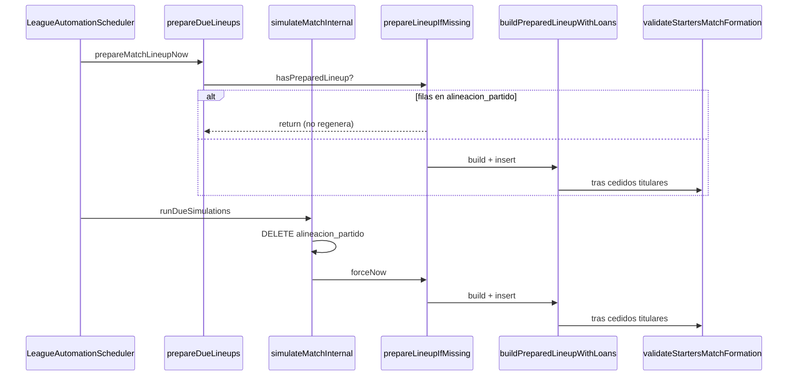

# Auditoría: cedidos no aplicados antes de `validateStartersMatchFormation` (partidos 28 y 979)

**Alcance:** solo lectura en código + SQL para producción.  
**No tocar:** fantasy (`alineacion_jornada_participante`), lógica deportiva de cedidos sustituida por heurísticas nuevas, simulación manual en ligas reales.

---

## 1. Resumen ejecutivo

| Hallazgo | Conclusión |
|----------|------------|
| ¿`validate` va antes de cedidos? | **No** en el código actual: los cedidos titulares se añaden en bucle y **`validateStartersMatchFormation` va después** (líneas ~1152 y ~1230). |
| ¿Los cedidos no cuentan en `validate`? | **Sí cuentan**: `countStartersByPosition` usa `TeamPlayerData.posicion()` del cedido (`jct.posicion` al crear el pick). |
| ¿`hasPreparedLineup` impide cedidos? | **Solo en `prepareDueLineups`**. En **`simulateMatchInternal` se borra `alineacion_partido` antes de preparar**, así que la simulación debería regenerar. |
| Causa más probable (Neo Japón 4-3-3, 3 DEF propios) | Rama **`sortedOwnPlayers.size() >= 11`**: préstamos solo si `11 - starters.size() > 0`. Con 10 titulares propios debería pedir 1 cedido DEF; si **no hay DEF en `jugadores_cedidos_temporada`**, `tryPickLoanPlayer` hace **fallback sin filtro de posición** y puede colocar un MED/DEL → **`validate` falla con DEF 3**. |
| Segunda causa (menos frecuente) | Once con **11 jugadores** pero **déficit de línea** (p. ej. 3 DEF + 4 MED): `starterLoansNeeded = 0` → **no entra el bucle de cedidos** aunque falte un DEF. |
| Mensaje en prod sin “actual POR…” | El error que viste encaja con **build antiguo** (mensaje sin conteos actuales). El código en repo ya añade `actual POR … DEF …`. |

**Fix mínimo aceptable (sin reemplazar el sistema de cedidos):**

1. En la rama `>= 11` propios, calcular plazas de cedido con **`max(11 - starters.size(), déficit por posición)`** antes del bucle (reutiliza `starterLoanPositionHints` + `tryPickLoanPlayer`).
2. Para **titulares**, no usar el fallback `queryLoanCandidates(..., posición null)` cuando se pidió una posición concreta; fallar con el mensaje ya existente *“No hay jugadores cedibles en la posición DEF…”*.

---

## 2. Flujo real en código



### 2.1 `prepareLineupIfMissing`

```428:469:src/main/java/com/eternalxi/eternalxi_api/services/LeagueSimulationService.java
    private void prepareLineupIfMissing(Connection conn, MatchHeader header, boolean forceNow) throws SQLException {
        if (hasPreparedLineup(conn, header.idPartido())) {
            return;
        }
        // ...
        PreparedLineupWithLoans localBundle = buildPreparedLineupWithLoans(...);
        PreparedLineupWithLoans awayBundle = buildPreparedLineupWithLoans(...);
        insertPreparedLineup(...);
        insertPartidoCesiones(...);
    }
```

- `hasPreparedLineup`: **`COUNT(*) > 0`** en `alineacion_partido` (no valida 11 titulares ni formación).
- Si hay **cualquier fila** (incluso incompleta o de un intento viejo), **`prepareDueLineups` no vuelve a ejecutar cedidos**.
- **`simulateMatchInternal`** llama antes a `deleteStaleSimulationArtifacts` → borra `alineacion_partido`, por lo que en simulación **sí** se vuelve a `buildPreparedLineupWithLoans`.

### 2.2 `buildPreparedLineupWithLoans` — orden cedidos vs validate

**Rama A — `sortedOwnPlayers.size() >= 11` (Neo Japón con plantilla grande):**

1. `buildPreparedLineup` → once solo propios (respeta líneas hasta agotar pool).
2. `starterLoansNeeded = 11 - starters.size()` ← **solo tamaño, no déficit por posición**.
3. Bucle `starterLoanPositionHints` → `tryPickLoanPlayer` por posición.
4. **`validateStartersMatchFormation(starters, formation)`**.
5. Banquillo con `fillBenchWithLoansIfNeeded` (solo convocatoria mínima 14).

**Rama B — `< 11` propios disponibles:**

1. `buildOwnSelectionForFormation` (propios por línea).
2. Completar propios hasta `maxStartersFromOwn`.
3. Mismo bucle de cedidos por hints + **`validate`**.
4. Banquillo condicional.

En **ambas ramas**, `validate` es **después** de insertar cedidos en la lista `starters` en memoria (antes de `insertPreparedLineup`).

### 2.3 `validateStartersMatchFormation`

Compara conteos en memoria (`starters`):

- POR = 1, DEF/MED/DEL = `formation` de `equipos.alineacion` (vía `parseTeamFormation`).
- **Incluye cedidos** si están en `starters` con `posicion` correcta.

No lee `alineacion_partido` de BD.

### 2.4 Persistencia de cedidos

- `insertPreparedLineup`: `tipo_origen_jugador = 'CEDIDO_EXCLUSIVO'`, `id_jugador_cedido_temporada`, `id_liga_equipo` = **`liga_equipos.id`**.
- `insertPartidoCesiones`: filas en `partido_cesiones` con origen.
- `loadPreparedRuntimeStates`: posición cedido = **`COALESCE(jct.posicion, j.posicion)`** — coherente con validate.

---

## 3. Respuestas a los 10 puntos de auditoría

| # | Pregunta | Respuesta |
|---|----------|-----------|
| 1 | `buildPreparedLineupWithLoans` | Dos ramas por número de propios disponibles; cedidos titulares vía `starterLoanPositionHints` + `tryPickLoanPlayer`; validate al final de titulares. |
| 2 | `prepareLineupIfMissing` | Salta todo si ya hay filas en `alineacion_partido`. |
| 3 | `validateStartersMatchFormation` | Solo lista en memoria; mensaje con esperado vs actual (código actual). |
| 4 | ¿Validate antes de cedidos? | **No.** |
| 5 | ¿Cedidos en BD pero no en validate? | No aplica a validate (es pre-insert). Si falla validate, **no hay INSERT**. Si hay filas en BD, vienen de un intento anterior o de otra ruta, no de un validate fallido en la misma transacción. |
| 6 | ¿Posición cedido correcta? | Sí si el pick es por `jct.posicion = ?`. **No** si entra el fallback sin posición (ver §4). |
| 7 | `hasPreparedLineup` | Cualquier fila → skip en prepare; **no** en simulate (borrado previo). |
| 8 | ¿`alineacion_partido` inválida en 28/979? | **Ejecutar SQL** (`audit_cedidos_partidos_28_979.sql`). Si hay filas y solo corre prepare, quedarían hasta que simule. |
| 9 | ¿Parser ignora cedidos? | No. Parser solo define `TeamFormation`; conteo usa `starters` completos. |
| 10 | `id_liga_equipo` vs `id_equipo` | `loadAvailableTeamPlayers` usa **`id_equipo` catálogo**; insert/cesiones usan **`id_liga_equipo`**; préstamos usan **`idEquipoDestinoCatalog`**. Coherente con `lockMatchHeader` si `pj.id_liga_equipo_*` guarda **`equipos.id`**. |

---

## 4. Caso Neo Japón (4-3-3, 3 DEF en `liga_jugadores`)

### Escenario A — 10 titulares propios (1+3+3+3)

- `starterLoansNeeded = 1`.
- Hints: `["DEF"]`.
- `tryPickLoanPlayer(..., "DEF", ...)`.
  - Si hay DEF en pool → titular cedido DEF → validate OK.
  - Si **no** hay DEF: `queryLoanCandidates` reintenta con **`preferredPosition = null`** → puede elegir **MED/DEL** → once de 11 con **DEF 3** → error exacto del scheduler.

### Escenario B — 11 titulares propios mal repartidos (3 DEF + 4 MED + …)

- `starterLoansNeeded = 0` → **bucle de cedidos vacío**.
- validate exige DEF 4 → fallo **sin intentar cedido DEF**.

`buildPreparedLineup` + `fillStartersFromPoolRespectingFormation` **no suelen generar 11 con solo 3 DEF** (se quedan en 10 si no hay más DEF). El escenario B requiere datos raros (posiciones mal etiquetadas, código viejo, o alineación ya persistida de otro origen).

### Escenario C — Producción con mensaje antiguo

Mensaje sin `; actual POR…` → desplegar build con auditoría de logs y mensaje nuevo para confirmar conteos reales en el próximo intento.

---

## 5. Qué debes sacar de SQL en prod (28 y 979)

Ejecutar:

- `src/main/resources/sql/audit_partidos_formacion_28_979.sql` (plantilla + alineación agregada).
- `src/main/resources/sql/audit_cedidos_partidos_28_979.sql` (detalle titulares, cedidos, pool DEF).

| Pregunta del informe | Consulta |
|----------------------|----------|
| ¿Qué hay en `alineacion_partido`? | A y E |
| Titulares por posición / cuántos cedidos | B |
| ¿Se registró cesión? | C |
| ¿Existía DEF cedible en temporada? | D |

**Interpretación:**

- **0 filas** en E → fallo siempre en memoria antes de insert; no es “alineación vieja”.
- **Filas con titulares DEF=3 y 0 cedidos** → cedidos no se aplicaron o partido preparado con código viejo.
- **Cedido titular con posición ≠ DEF** → confirma fallback sin posición en `tryPickLoanPlayer`.
- **Pool D sin DEF** → no hay cedido DEF; el sistema debería fallar claro, no en validate de formación.

---

## 6. Fix mínimo (sin sustituir cedidos)

| Cambio | Motivo |
|--------|--------|
| `starterLoansNeeded = max(11 - starters.size(), déficitPorPosición)` en rama `>= 11` | Misma API de hints/`tryPickLoanPlayer`; cubre déficit de línea con once ya lleno. |
| No hacer fallback `posición null` cuando el préstamo es **titular** y se pidió DEF/MED/DEL/POR | Evita cedido en posición incorrecta que pasa al once pero falla validate. |
| Mantener `preparacion_bloqueada_*`, `allowed-league-ids=7`, logs | Ya acordado; no reintento infinito. |

**No hace falta** tocar `alineacion_jornada_participante`, ni relajar validate, ni un algoritmo nuevo de plantilla.

**Operativa:** tras fix + migración, desbloquear partidos (`preparacion_bloqueada_en = NULL`) solo cuando pool DEF o plantilla lo permitan.

---

## 7. Datos que no puedo rellenar desde aquí

Los conteos concretos de **partido 28 / 979** (titulares, cedidos, posiciones) solo salen de tu ejecución SQL en producción. Pega el resultado de las consultas B y E si quieres cerrar el informe con números exactos.
