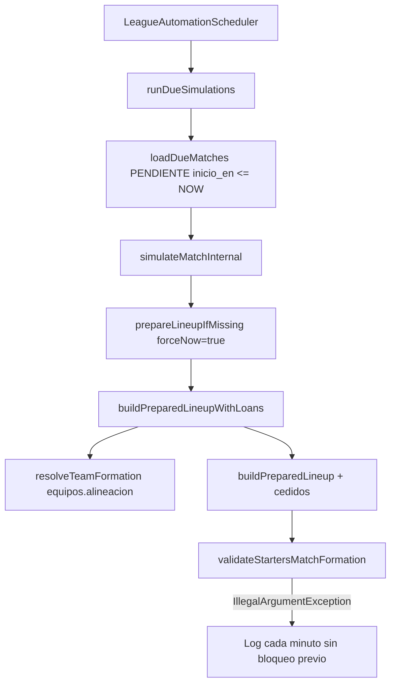

# Auditoría: fallo de formación en simulación automática (partidos 28 y 979)

**Sin modificar datos de producción.** Ejecutar `src/main/resources/sql/audit_partidos_formacion_28_979.sql` en la BD.

## Resumen ejecutivo

| Pregunta | Respuesta en código |
|----------|---------------------|
| ¿Qué formación usa la simulación? | **`equipos.alineacion`** del catálogo (join `liga_equipos` → `equipos`), vía `resolveTeamFormation` / `parseTeamFormation`. |
| ¿Usa entrenador fantasy? | **No.** `LeagueLineupService` / `liga_participante_entrenador` es solo alineación fantasy de usuarios. |
| ¿Fallback 4-3-3? | **Sí**, si `alineacion` es null, vacía, formato inválido o def+med+del ≠ 10. |
| ¿Mezcla fantasy con simulación real? | **No en la misma ruta**, pero un `equipos.alineacion` mal guardado (p. ej. `4-2-3-1` con 4 segmentos) provoca fallback silencioso a 4-3-3. |

El error que ves:

```text
La formación titular no coincide con equipos.alineacion (POR 1, DEF 4, MED 3, DEL 3)
```

significa que **`parseTeamFormation` interpretó 4-3-3** (1 portero + 4 def + 3 med + 3 del), pero el once generado **no tiene esos conteos por posición** (p. ej. 3 DEF y 4 MED).

## Flujo que falla



## Causas probables (orden de probabilidad)

1. **`equipos.alineacion` con formato no soportado** (p. ej. `4-2-3-1`, `3-5-2` con guiones extra) → fallback **4-3-3** mientras la plantilla real está equilibrada para otra táctica.
2. **Plantilla insuficiente por línea** y composición del once tras `fillStartersFromPoolRespectingFormation` + cedidos que no cuadra (menos habitual si los cedidos filtran por `jct.posicion`).
3. **Datos de posición** en `jugadores.posicion` incoherentes con la formación esperada.

## Qué revisar en BD (partidos 28 y 979)

1. Equipos local/visitante y `equipos.alineacion` (consulta 1 del SQL).
2. Recuento `jugadores.posicion` por `liga_jugadores.id_equipo` (consulta 2).
3. Si existe `alineacion_partido` a medias (consulta 3) — `hasPreparedLineup` evita regenerar; si hay 11 filas mal formadas, habría que limpiar manualmente (fuera de este doc).

## Protecciones añadidas en código

| Medida | Descripción |
|--------|-------------|
| `app.league.automation.allowed-league-ids` | Lista blanca; vacío = todas (legacy). En prod usar solo liga TEST, p. ej. `7`. |
| `preparacion_bloqueada_en` / `motivo` | Tras error estructural de preparación, el partido no vuelve a entrar en `loadDueMatches` / `prepareDueLineups`. |
| Parser 4 segmentos | `4-2-3-1` → DEF + (MED línea 2 + línea 3) + DEL. |
| Mensaje de validación | Incluye conteos **esperados vs actuales** por posición. |

## Desbloquear un partido (solo operaciones, con cuidado)

```sql
-- Ver bloqueo
SELECT id, preparacion_bloqueada_en, preparacion_bloqueada_motivo
FROM partidos_jornada WHERE id IN (28, 979);

-- Tras corregir equipos.alineacion o plantilla:
UPDATE partidos_jornada
SET preparacion_bloqueada_en = NULL, preparacion_bloqueada_motivo = NULL
WHERE id = ?;
```

No ejecutar simulación manual en ligas reales salvo liga TEST acordada.
