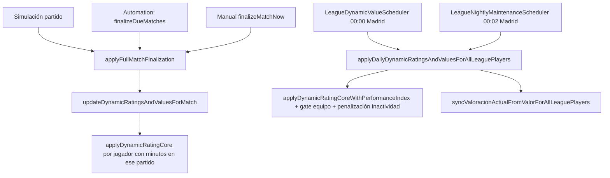

# Auditoría: valor dinámico (`valor` / `valoracion_actual`)

**Alcance:** solo lectura de código + SQL de diagnóstico. **No se modifica la fórmula** en esta fase.

---

## 1. Método exacto donde se recalcula

| Capa | Método | Qué persiste |
|------|--------|----------------|
| Núcleo | `LeagueSimulationService.applyDynamicRatingCoreWithPerformanceIndex` | Calcula índice, rating fantasy, `targetValue`, guardrails → llama `updatePlayerDynamicRow` |
| Tras partido | `applyDynamicRatingCore` → mismo núcleo con `performanceIndex = computeBasePerformanceIndex(snapshot)` | Igual |
| Persistencia | `updatePlayerDynamicRow` | `valor_anterior ← valor previo`, `valor ← newValue`, `valoracion_actual ← estimateRatingFromMarketValue(newValue, posición)` |

Curva precio ↔ rating: `LeaguePlayerPricingService.calculateValueFromDynamicRating` / `estimateRatingFromMarketValue`.

---

## 2. Cuándo se ejecuta



| Disparador | Clase / cron | Notas |
|------------|--------------|--------|
| **Fin de partido** | `updateDynamicRatingsAndValuesForMatch` desde `applyFullMatchFinalization` | Solo jugadores en `alineacion_partido` del partido, con `jugadores_puntos_jornada` en esa jornada, **minutos > 0**, **no cedidos** (`partido_cesiones` null). |
| **Scheduler liga** | `LeagueAutomationScheduler` → simula → misma finalización | Mismo núcleo post-partido. |
| **Valor diario** | `LeagueDynamicValueScheduler` (`app.league.dynamic-value.cron`, default medianoche) | Todos los `liga_jugadores`; **gate**: equipo de catálogo sin ningún partido `FINALIZADO` en la liga → **no toca valor**. |
| **Mantenimiento nocturno** | `LeagueNightlyMaintenanceScheduler` (`0 2 0 * * *`) | Repite valor diario + recalcula titularidades + `syncValoracionActualFromValor`. |
| **Solo alineación rating↔precio** | `syncValoracionActualFromValorForAllLeaguePlayers` | **No mueve `valor`**; ajusta `valoracion_actual` a la inversa del precio actual. |

**No** recalcula valor: compra/venta, ofertas, mercado nocturno (salvo indirección por puntos al jugar), cartas de recuperación (solo valor efectivo de cara al usuario).

---

## 3. Fórmula actual (resumen ejecutivo)

### Entradas (`ProgressionSnapshot`)

- `valor` actual, `valoracion_actual` (OVR carta en liga).
- `posicion` (POR/DEF/MED/DEL).
- **Media fantasy últimos 3 partidos** (`AVG` últimas filas `jugadores_puntos_jornada`).
- **Último partido**: `puntos_ultimo_partido`, `minutos_ultimo_partido` (para guardrails y penalización nocturna).
- `estado_liga` (DISPONIBLE / LESIONADO / SANCIONADO / …).

### Paso A — Índice de rendimiento (`performanceIndex`)

Por defecto (post-partido):

```
par = fantasyParMeanPointsFromMarket(valor)   // ~3.4–10.2 pts según millones €
ratio = media_ultimos_3 / par
si ratio >= 1: index = 10 * ratio^1.30
si ratio < 1:  index = 10 * ratio^1.06
index = clamp(index, 0, 20)
```

Si **LESIONADO/SANCIONADO**: `index = min(index, 7.65)`.

Batch nocturno: `adjustedIndex = max(4, baseIndex - computeDailyFantasyDecayPenalty(...))` (inactividad / último partido flojo).

### Paso B — Delta valoración fantasy

```
expectedIndex = 10
sensitivity = sensitivityByMarketProfile(valor, valoracion_actual)  // baja si caro / OVR alto
maxUp = maxPositiveDeltaRatingByOvr(valoracion_actual)              // techo subida OVR
deltaRating = clamp((index - 10) * sensitivity, -0.40, maxUp)
fantasyRating = clamp(valoracion_actual + deltaRating, 60, 99)  // redondeo 2 dec
```

### Paso C — Objetivo de mercado

```
theoreticalValue = calculateValueFromDynamicRating(fantasyRating, posición)  // bandas OVR + mult. posición + redondeo 25k/50k/100k
targetValue = round(theoreticalValue * formMultiplier(index))               // ~0.985–1.048
```

`formMultiplier`: neutro ~1.0 cerca de index 10; sube si index alto.

### Paso D — Movimiento acotado (`moveTowards`)

```
maxDelta = min(valor * movementLimitPercentage(valor), movementCapByValue(valor))
newValue = valor ± min(|target - valor|, maxDelta)   // suelo ABSOLUTE_MIN = 500_000
```

`movementLimitPercentage`: ~1.8%–3.8% según tramo; `movementCapByValue`: tope absoluto (ej. 4.5M si ≥150M).

### Paso E — Guardrails (solo si `skipValueProtectiveGuards` = false)

`skip` si **LESIONADO/SANCIONADO** o (`puntos < 0` y `minutos ≥ 20`).

| Condición | Efecto |
|-----------|--------|
| puntos ≥ 10 y min ≥ 60 | No bajar respecto a valor previo |
| puntos ≥ 7 y min ≥ 60 | Caída máx. 0.25% del valor o 150k |
| valor < 2M, min ≥ 60, puntos ≥ 3 | No bajar |
| valor < 5M, min ≥ 60, puntos ≥ 3 | No bajar |
| valor < 5M, min ≥ 60, puntos = 2 | Mínimo 99.75% del valor |
| Lesión/sanción (estado) | Fuerza bajada mínima ~0.85% (40k–550k) aunque guardrails amables |
| puntos < 0 y min ≥ 22 | Penalización extra `extraMarketLossFromNegativeFantasyPoints` (hasta ~1M) |

### Paso F — Persistencia

```
newRating = estimateRatingFromMarketValue(newValue, posición)
si newValue < getFloorValueForRating(newRating): subir a floor (ej. 100M si OVR≥90)
UPDATE valor_anterior, valor, valoracion_actual
```

Log `Dynamic value guardrail` si `latestPoints >= 7`.

---

## 4. Qué significa “sin cambios”

En BD: **`valor` nuevo = `valor` leído al inicio del tick** (antes de `UPDATE`), tras:

1. `moveTowards` dejó `targetValue` tan cerca que el delta quedó **0** (o por debajo del paso de redondeo efectivo), **o**
2. Un **guardrail** subió `newValue` hasta el valor anterior (p. ej. buen partido → no bajar), **o**
3. **Batch nocturno**: `gateUntilTeamHasFinalizedMatch` → método retorna `false` → **no hay UPDATE** (valor intacto), **o**
4. Jugador **no entró** en `updateDynamicRatingsAndValuesForMatch` (0 minutos, cedido, no en alineación).

`valor_anterior` en UI suele ser el valor del tick anterior; si no hubo UPDATE, `valor` y `valor_anterior` pueden coincidir con el último cambio real.

---

## 5. Condiciones típicas de delta = 0

- `targetValue ≈ valor` y `maxDelta` permite llegar pero ya está en destino.
- Guardrail “no bajar” con partido ≥7 pts y 60 min.
- Guardrail jugador barato (<5M) con partido aceptable.
- Índice ≈ 10 (media ≈ par) → `deltaRating ≈ 0` → `target ≈ valor`.
- Crack caro (OVR 95+): `sensitivity` y `maxUp` bajos → casi no mueve rating ni valor en un solo tick.
- Gate nocturno: equipo sin partido finalizado → no corre el job para ese jugador.
- No procesado en cierre de partido (suplente 0 min, cedido).

---

## 6–9. Casos intuitivos

### Buen partido y sin cambio

- Media últimos 3 **ya alta** → index ya >10; un solo partido bueno no mueve más (`moveTowards` cap).
- Par de puntos **alto** por precio (crack): 8 pts “buenos” pero ratio media/par ≈ 1 → neutro.
- Guardrail anti-bajada no aplica a subida: si `target ≤ valor`, delta 0.
- Solo se actualizó en un tick anterior; este partido no dispara nuevo paso (cedido / 0 min).

### Mal partido y sin cambio

- Pocos minutos (<60): guardrails fuertes no aplican igual, pero `moveTowards` limita caída; par bajo en jugador barato → index no cae mucho.
- Media últimos 3 **aún buena** (arrastra partidos viejos).
- Lesión: guardrails saltados pero penalización por estado puede no ejecutarse si no pasó por core ese día.

### Caro que baja con partido aceptable

- Media últimos 3 **baja** vs par alto (crack debe hacer ~9–10 pts de media).
- `targetValue` < valor y `maxDelta` permite bajar (hasta %/cap).
- Lesión/sanción fuerza techo de bajada.
- Partido “aceptable” (6–7 pts) por debajo del par de un 100M€.

### Barato que sube mucho

- Media últimos 3 **muy superior** al par bajo (~4 pts).
- `sensitivity` alta en jugadores <10M.
- `formMultiplier` > 1 con index alto.
- `maxDelta` % alto en tramo barato (hasta ~3.8% por tick).

---

## 10–11. Cartas recuperación temporal (`TEMPORARY_VALUE_RECOVERY`)

| Concepto | Comportamiento |
|----------|----------------|
| **valor base** (`liga_jugadores.valor`) | Lo mueve solo `updatePlayerDynamicRow` (partido + jobs). **La carta no escribe `valor`.** |
| **valor efectivo** | `LeaguePlayerMarketValueService.effectiveValueFromBase(valor, %mod)` = `floor(valor * (1 + %))` |
| **valorMercadoEfectivo** en API | Mismo: lectura con modificador activo en `liga_jugador_modificadores_valor` |
| **Modificador** | Fila en `liga_jugador_modificadores_valor`; expira cuando jornada `FINALIZADA` |

**Confirmación:** la carta **no cambia el valor base** si el diseño es solo buff temporal de mercado/ofertas; el núcleo dinámico ignora modificadores.

---

## SQL y ejemplos reales

- Diagnóstico ampliado: `src/main/resources/sql/audit_valor_dinamico_diagnostico.sql`
- Ejemplos A–F rápidos: `docs/informe-valor-mercado-ejemplos.sql` (ajustar `@id_liga`)

Para **targetValue y guardrail exactos** por jugador hace falta log `Dynamic value guardrail` (puntos ≥ 7) o depurar `applyDynamicRatingCoreWithPerformanceIndex` en IDE; el SQL aproxima par e índice.

---

## Endpoint de diagnóstico (opcional futuro)

No incluido en código para no duplicar 120 líneas de guardrails. Alternativa: endpoint que re-ejecute solo lectura vía tests o script Java que llame a método package-private en entorno dev.

Propuesta si se implementa después:

`GET /api/v1/leagues/{idLiga}/diagnostics/dynamic-value/{idLigaJugador}` → JSON con snapshot + índice + target aproximado (sin UPDATE).
